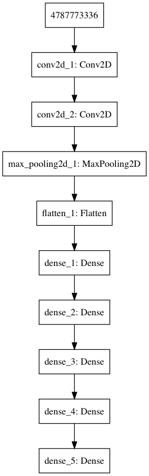
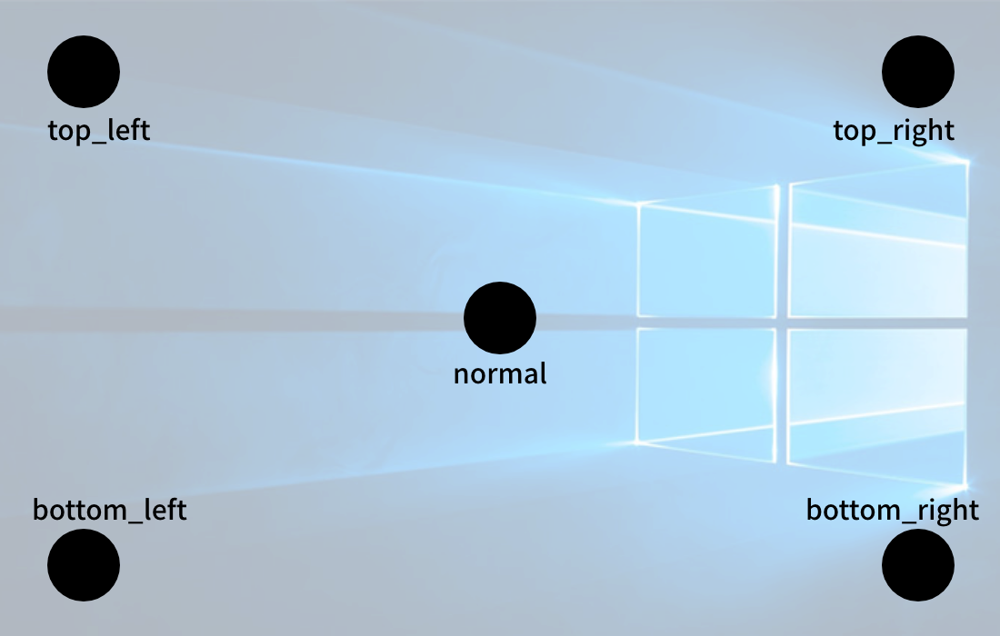

# Watchme AI-Pupil-Tracker


## Scripts

### [collector.py](./collector.py)
Generate pupil dataset from video camera

### [arrange_dataset.py](./arrange_dataset.py)
Arrange dataset files automatically to [Keras dataset format for classification](https://stackoverflow.com/questions/44998778/keras-zerodivisionerror-integer-division-or-modulo-by-zero#answer-45007047) 

### [preprocessor.py](./preprocessor.py)
Contains methods for data preprocessing

### [build.py](./build.py)
Builds, trains, and saves the model

## Example


```py
from preprocessor import apply_threshold
import numpy as np
from keras.models import load_model
from keras.preprocessing import image

model = load_model('./model.h5')

img = image.load_img(img_path, target_size=(64, 64))
img = np.expand_dims(image.img_to_array(img), axis=0)

result = model.predict_classes(img)
print(['bottom_left', 'bottom_right', 'normal', 'top_left', 'top_right'][result[0]])
```

이걸 좀 고치고 result 가지고 [watchme-closed-eye-detection](https://github.com/junhoyeo/watchme-closed-eye-detection) 얘랑 합쳐서 사용자 눈 감김 여부와 함께 포지션을 parent process로 보내주면 될 것임
